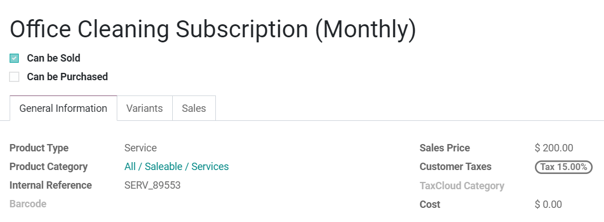

=========================
Add subscription products
=========================

Subscription products are required to create a quotation and continue the sales flow regarding your
subscriptions. Indeed, after conceiving your own subscription templates, you will have to create
your subscription products in order to be able to suggest your customer an interesting offer.

Create your first subscription products
=======================================

Go to :menuselection:`Subscriptions → Subscription products`. There, you will have the possibility
to create a new template or edit an existing one. Once named, be careful to select the option
**Can be sold** and deselect **Can be purchased**. For the product type, it is recommended to use
**Service** for subscription products. After that, you can adapt your price and also add an internal
reference.

.. note::
   In the sales tab, underneath the subscriptions section, you can check if the subscription
   products option is selected. In fact, if you create a subscription product from the
   **Subscriptions** application, this option will be selected by default. However, if you create
   a product from another application, it will not be the case.

   .. image:: media/subscription_products_2.png
     :align: center
     :alt: How to use subscription products on Odoo Subscriptions?

   You can also choose the subscription templates you want to use (as you can see below).

   .. image:: media/subscription_products_3.png
     :align: center
     :alt: How to use subscription products on Odoo Subscriptions?

.. important::
   Be sure to check out our documentation on how to create, edit and manage your own subscription
   templates: :doc:`subscription_templates`, to master each step of this amazing application.

.. seealso::
  - :doc:`subscription_templates`